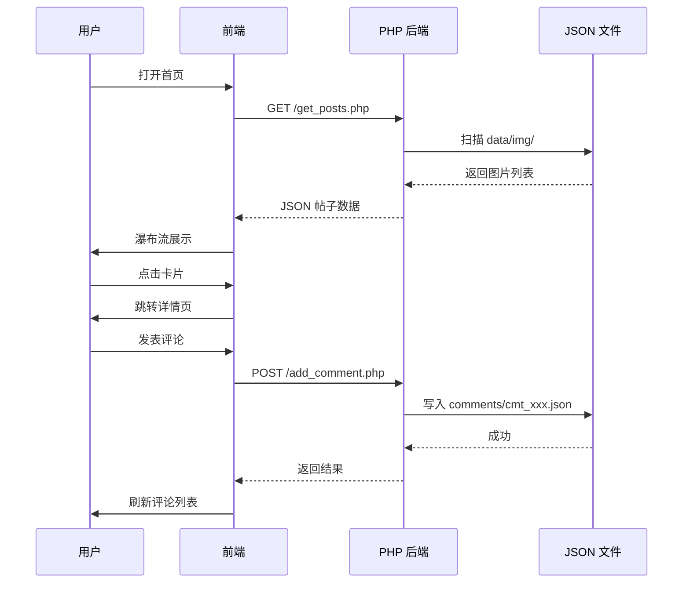
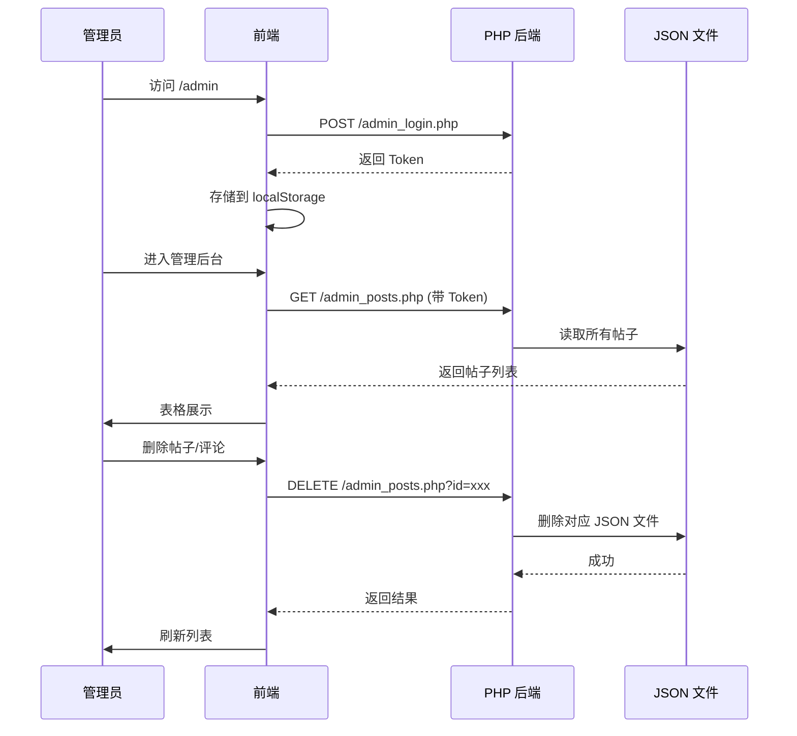

# 🍉 吃瓜点评 - 小红书风格图文社区

> 纯前端 React + 轻量 PHP 后端，**零数据库、纯 JSON 文件存储**，开箱即用的图片点评社区

---

## 技术栈

| 层级 | 技术 |
|------|------|
| 前端 | React 19 + react-router-dom + axios |
| 后端 | 原生 PHP（无需框架） |
| 存储 | JSON 文件（替代数据库） |
| 部署 | `npm run build` → `dist/` 目录直接丢到服务器 |

---

## 功能一览

### 👤 用户端

| 功能 | 说明 |
|------|------|
| 🏠 首页瀑布流 | 自动扫描 `data/img/` 图片，小红书卡片式展示 |
| 🔥 热门排行 | 按点赞×1 + 评论×2 + 分享×3 算法排序 |
| 📖 详情浏览 | 大图预览 + 帖子信息 + 互动操作 |
| 💬 评论回复 | 支持二级嵌套回复，树形展示 |
| 🤫 匿名评论 | 全局开关，开启后使用随机昵称签名 |
| ❤️ 点赞/转发 | 计数统计 + 分享弹窗（含二维码） |
| 📝 发布帖子 | 上传图片 + 标题 + 描述，即时生效 |
| 🎯 相关推荐 | 详情页底部随机推荐，无限下滑加载 |

### 🔐 管理端

| 功能 | 说明 |
|------|------|
| 🔑 管理员登录 | Token 认证，localStorage 持久化 |
| 📊 帖子管理 | 查看所有帖子、编辑信息、删除 |
| 💬 评论管理 | 查看、编辑、删除任意评论 |

---

## 系统架构

```
┌─────────────────────────────────────────────────┐
│                    用户浏览器                      │
│   ┌─────────────── React 前端 (SPA) ─────────────┐│
│   │ Navbar │ 瀑布流 │ 详情页 │ 管理后台 │ 发布弹窗 ││
│   └────────────────────┬─────────────────────────┘│
│                        │  axios 请求               │
└────────────────────────┼──────────────────────────┘
                         │
┌────────────────────────┼──────────────────────────┐
│                        ▼                           │
│   ┌─────────── PHP 接口层 ───────────┐             │
│   │ get_posts / add_comment / like   │             │
│   │ publish / admin_* / stats ...    │             │
│   └───────────────┬──────────────────┘             │
│                   │                                 │
│                   ▼                                 │
│   ┌─────────── JSON 文件存储 ──────────┐            │
│   │ data/img/      图片文件             │            │
│   │ data/comments/ 评论 JSON            │            │
│   │ data/posts/    帖子 & 统计 JSON     │            │
│   │ data/nickname.md 随机昵称词库       │            │
│   └────────────────────────────────────┘            │
└─────────────────────────────────────────────────────┘
```

---

## 项目结构

```
react-xiaohongshu-51chigua/
├── react-front/            # React 前端
│   └── src/
│       ├── api.js          # 接口封装（公共 + 管理）
│       ├── App.js          # 路由配置
│       └── components/
│           ├── Navbar.js           # 导航栏
│           ├── WaterfallList.js    # 首页瀑布流
│           ├── PostDetail.js       # 详情页
│           ├── PublishModal.js     # 发布弹窗
│           ├── ShareModal.js       # 分享弹窗
│           └── Admin/
│               ├── AdminLogin.js       # 管理员登录
│               └── AdminDashboard.js   # 管理后台
├── php-api/                # PHP 接口
│   ├── config.php          # 配置
│   ├── helper.php          # 公共工具函数
│   ├── get_posts.php       # 获取帖子列表
│   ├── get_random_posts.php# 随机推荐（无限加载）
│   ├── add_comment.php     # 发表评论
│   ├── get_comment.php     # 获取评论
│   ├── like_post.php       # 点赞
│   ├── share_post.php      # 转发
│   ├── get_post_stats.php  # 帖子统计
│   ├── publish_post.php    # 发布帖子
│   ├── get_random_nickname.php # 随机昵称
│   ├── admin_login.php     # 管理员登录
│   ├── admin_posts.php     # 帖子管理
│   └── admin_comments.php  # 评论管理
├── data/                   # 数据存储
│   ├── img/                # 图片目录
│   ├── comments/           # 评论数据
│   ├── posts/              # 帖子 & 统计
│   └── nickname.md         # 随机昵称词库
└── dist/                   # 构建产物（部署用）
```

---

## 快速开始

```bash
# 1. 启动 PHP 服务（项目根目录）
cd php-api && php -S localhost:8000

# 2. 启动 React 开发服务
cd react-front && npm install && npm start

# 3. 浏览器打开 http://localhost:3000
```

### 构建部署

```bash
cd react-front && npm run build
# 产物在 dist/ 目录，直接部署到任意 Web 服务器
```

---

## 核心流程

### 浏览 & 评论



### 管理后台


