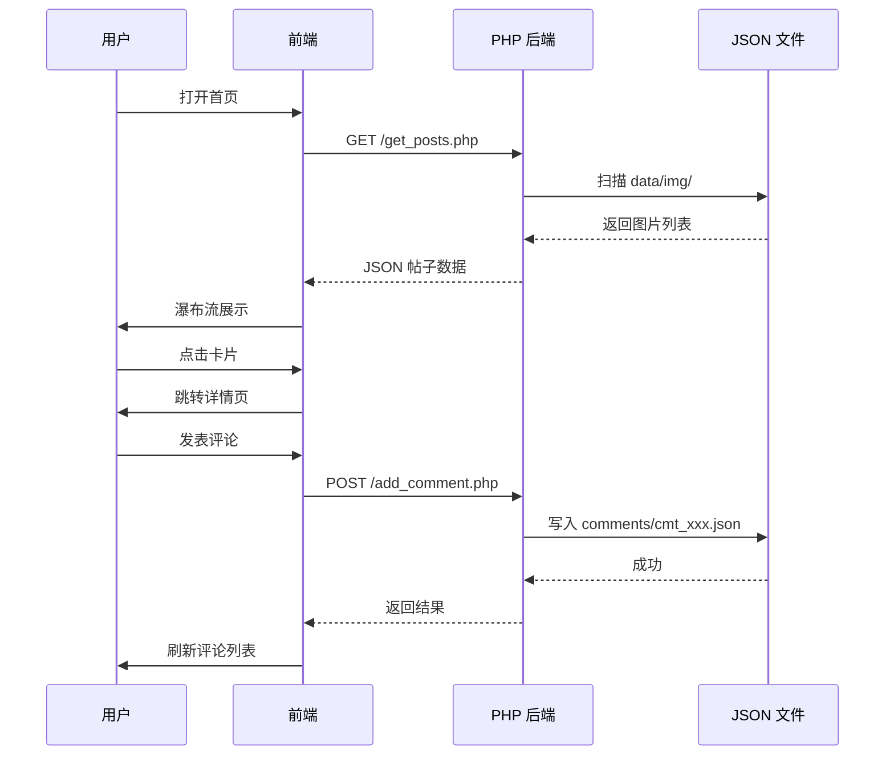
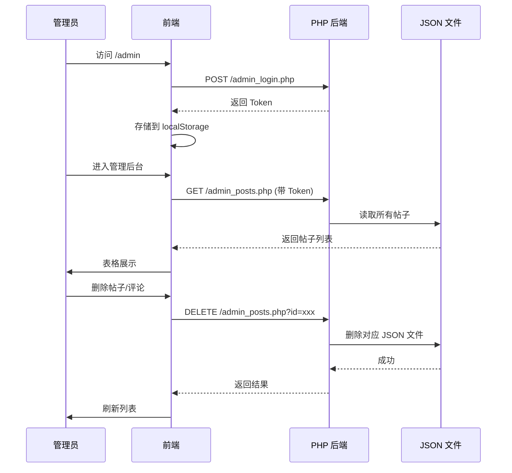

<<<<<<< HEAD
# 🍉 吃瓜点评 - 小红书风格图文社区

> 纯前端 React + 轻量 PHP 后端，**零数据库、纯 JSON 文件存储**，开箱即用的图片点评社区

---

## 技术栈

| 层级 | 技术 |
|------|------|
| 前端 | React 19 + react-router-dom + axios |
| 后端 | 原生 PHP（无需框架） |
| 存储 | JSON 文件（替代数据库） |
| 部署 | `npm run build` → `dist/` 目录直接丢到服务器 |

---

## 功能一览

### 👤 用户端

| 功能 | 说明 |
|------|------|
| 🏠 首页瀑布流 | 自动扫描 `data/img/` 图片，小红书卡片式展示 |
| 🔥 热门排行 | 按点赞×1 + 评论×2 + 分享×3 算法排序 |
| 📖 详情浏览 | 大图预览 + 帖子信息 + 互动操作 |
| 💬 评论回复 | 支持二级嵌套回复，树形展示 |
| 🤫 匿名评论 | 全局开关，开启后使用随机昵称签名 |
| ❤️ 点赞/转发 | 计数统计 + 分享弹窗（含二维码） |
| 📝 发布帖子 | 上传图片 + 标题 + 描述，即时生效 |
| 🎯 相关推荐 | 详情页底部随机推荐，无限下滑加载 |

### 🔐 管理端

| 功能 | 说明 |
|------|------|
| 🔑 管理员登录 | Token 认证，localStorage 持久化 |
| 📊 帖子管理 | 查看所有帖子、编辑信息、删除 |
| 💬 评论管理 | 查看、编辑、删除任意评论 |

---

## 系统架构

```
┌─────────────────────────────────────────────────┐
│                    用户浏览器                      │
│   ┌─────────────── React 前端 (SPA) ─────────────┐│
│   │ Navbar │ 瀑布流 │ 详情页 │ 管理后台 │ 发布弹窗 ││
│   └────────────────────┬─────────────────────────┘│
│                        │  axios 请求               │
└────────────────────────┼──────────────────────────┘
                         │
┌────────────────────────┼──────────────────────────┐
│                        ▼                           │
│   ┌─────────── PHP 接口层 ───────────┐             │
│   │ get_posts / add_comment / like   │             │
│   │ publish / admin_* / stats ...    │             │
│   └───────────────┬──────────────────┘             │
│                   │                                 │
│                   ▼                                 │
│   ┌─────────── JSON 文件存储 ──────────┐            │
│   │ data/img/      图片文件             │            │
│   │ data/comments/ 评论 JSON            │            │
│   │ data/posts/    帖子 & 统计 JSON     │            │
│   │ data/nickname.md 随机昵称词库       │            │
│   └────────────────────────────────────┘            │
└─────────────────────────────────────────────────────┘
```

---

## 项目结构

```
react-xiaohongshu-51chigua/
├── react-front/            # React 前端
│   └── src/
│       ├── api.js          # 接口封装（公共 + 管理）
│       ├── App.js          # 路由配置
│       └── components/
│           ├── Navbar.js           # 导航栏
│           ├── WaterfallList.js    # 首页瀑布流
│           ├── PostDetail.js       # 详情页
│           ├── PublishModal.js     # 发布弹窗
│           ├── ShareModal.js       # 分享弹窗
│           └── Admin/
│               ├── AdminLogin.js       # 管理员登录
│               └── AdminDashboard.js   # 管理后台
├── php-api/                # PHP 接口
│   ├── config.php          # 配置
│   ├── helper.php          # 公共工具函数
│   ├── get_posts.php       # 获取帖子列表
│   ├── get_random_posts.php# 随机推荐（无限加载）
│   ├── add_comment.php     # 发表评论
│   ├── get_comment.php     # 获取评论
│   ├── like_post.php       # 点赞
│   ├── share_post.php      # 转发
│   ├── get_post_stats.php  # 帖子统计
│   ├── publish_post.php    # 发布帖子
│   ├── get_random_nickname.php # 随机昵称
│   ├── admin_login.php     # 管理员登录
│   ├── admin_posts.php     # 帖子管理
│   └── admin_comments.php  # 评论管理
├── data/                   # 数据存储
│   ├── img/                # 图片目录
│   ├── comments/           # 评论数据
│   ├── posts/              # 帖子 & 统计
│   └── nickname.md         # 随机昵称词库
└── dist/                   # 构建产物（部署用）
```

---

## 快速开始

```bash
# 1. 启动 PHP 服务（项目根目录）
cd php-api && php -S localhost:8000

# 2. 启动 React 开发服务
cd react-front && npm install && npm start

# 3. 浏览器打开 http://localhost:3000
```

### 构建部署

```bash
cd react-front && npm run build
# 产物在 dist/ 目录，直接部署到任意 Web 服务器
```

---

## 核心流程

### 浏览 & 评论



### 管理后台


=======
# react-xiaohongshu-51chigua

纯 React 实现 小红书卡片布局、评论区、回复功能 颜值高、移动端适配完美 零依赖快速启动
# 吃瓜美女图片点评项目 落地执行计划（可一步步验证、可直接照做）
## 项目整体架构
- 前端：React 小红书风格图文瀑布流、详情页、点评/回复
- 后端：原生PHP 接口，**无数据库、纯文件存储**
- 已有资源：固定图片目录 `data/img` 只放原图
- 数据存储规则：所有点评、回复、文章信息 全部存 **JSON文件**
- 核心功能：图片列表、图文详情、发表点评、点评回复

## 整体目录规划（先建好目录，第一步验证）
先在项目根目录建好以下文件夹，**建好即验证完成**
```
项目根目录/
├── data/
│   ├── img/        # 已有，存放所有美女吃瓜原图
│   ├── posts/      # 存每篇图文帖子信息 json
│   ├── comments/   # 存所有点评、回复 json
│   └── config.json # 全局配置（网站名称、分页条数）
├── php-api/        # PHP后端所有接口文件
└── react-front/   # React前端项目
```
✅ 第一步验证：手动建好上面 `data/posts`、`data/comments` 两个空文件夹，确认目录结构无误。

---

# 阶段一：后端PHP搭建（纯文件存储，逐步可验证）
## 步骤1：编写基础配置文件
新建 `data/config.json`
```json
{
  "site_name": "吃瓜美女点评",
  "page_size": 12
}
```
✅ 验证：打开文件能正常读取JSON，无语法报错。

## 步骤2：PHP通用工具函数（公共方法）
新建 `php-api/helper.php`
封装：读JSON、写JSON、获取图片列表、生成唯一ID
```php
<?php
// 读取JSON文件
function getJsonFile($path) {
    if(!file_exists($path)) return [];
    return json_decode(file_get_contents($path), true) ?: [];
}

// 写入JSON文件
function saveJsonFile($path, $data) {
    file_put_contents($path, json_encode($data, JSON_UNESCAPED_UNICODE|JSON_PRETTY_PRINT));
}

// 获取data/img下所有图片
function getImgList() {
    $imgDir = dirname(__DIR__) . '/data/img/';
    $files = [];
    $allow = ['jpg','jpeg','png','gif','webp'];
    foreach(scandir($imgDir) as $f){
        $ext = strtolower(pathinfo($f,PATHINFO_EXTENSION));
        if(in_array($ext,$allow)){
            $files[] = 'data/img/'.$f;
        }
    }
    return $files;
}

// 生成唯一ID
function genId(){
    return date('YmdHis') . mt_rand(100,999);
}
?>
```
✅ 验证：访问 `你的域名/php-api/helper.php` 空白不报错即可。

## 步骤3：接口1 - 获取所有图片帖子列表
新建 `php-api/get_posts.php`
自动扫描 `data/img` 图片，生成图文列表
```php
<?php
header("Content-Type: application/json;charset=utf-8");
require_once 'helper.php';

$imgList = getImgList();
$posts = [];

foreach($imgList as $idx=>$img){
    $posts[] = [
        'id' => genId(),
        'img' => $img,
        'title' => '吃瓜美女图集'.$idx,
        'desc' => '高清美女吃瓜日常点评',
        'create_time' => date('Y-m-d H:i:s')
    ];
}

echo json_encode(['code'=>0,'list'=>$posts], JSON_UNESCAPED_UNICODE);
?>
```
✅ 验证：浏览器访问 `php-api/get_posts.php` 能输出图片列表JSON，能读到 `data/img` 里所有图。

## 步骤4：接口2 - 提交点评
新建 `php-api/add_comment.php`
接收前端内容，存入 `data/comments/` 按帖子ID分文件
```php
<?php
header("Content-Type: application/json;charset=utf-8");
require_once 'helper.php';

$postId = $_POST['post_id'] ?? '';
$content = $_POST['content'] ?? '';
$username = $_POST['username'] ?? '匿名吃瓜用户';

if(empty($postId) || empty($content)){
    echo json_encode(['code'=>1,'msg'=>'参数缺失']);exit;
}

$file = dirname(__DIR__)."/data/comments/cmt_".$postId.".json";
$list = getJsonFile($file);

$list[] = [
    'id' => genId(),
    'post_id' => $postId,
    'username' => $username,
    'content' => $content,
    'time' => date('Y-m-d H:i:s'),
    'reply' => []
];

saveJsonFile($file, $list);
echo json_encode(['code'=>0,'msg'=>'点评发布成功']);
?>
```
✅ 验证：用Postman/浏览器传参提交，能自动生成 `cmt_xxx.json` 文件。

## 步骤5：接口3 - 获取某帖子所有点评
新建 `php-api/get_comment.php`
```php
<?php
header("Content-Type: application/json;charset=utf-8");
require_once 'helper.php';

$postId = $_GET['post_id'] ?? '';
$file = dirname(__DIR__)."/data/comments/cmt_".$postId.".json";
$list = getJsonFile($file);

echo json_encode(['code'=>0,'list'=>$list], JSON_UNESCAPED_UNICODE);
?>
```
✅ 验证：传入post_id，能读出对应点评列表。

## 步骤6：接口4 - 点评回复接口
新建 `php-api/add_reply.php`
给某条点评追加回复，存在同个json里
```php
<?php
header("Content-Type: application/json;charset=utf-8");
require_once 'helper.php';

$postId = $_POST['post_id'] ?? '';
$cmtId = $_POST['cmt_id'] ?? '';
$content = $_POST['content'] ?? '';
$username = $_POST['username'] ?? '匿名';

$file = dirname(__DIR__)."/data/comments/cmt_".$postId.".json";
$list = getJsonFile($file);

foreach($list as &$item){
    if($item['id'] == $cmtId){
        $item['reply'][] = [
            'id' => genId(),
            'username' => $username,
            'content' => $content,
            'time' => date('Y-m-d H:i:s')
        ];
        break;
    }
}

saveJsonFile($file, $list);
echo json_encode(['code'=>0,'msg'=>'回复成功']);
?>
```
✅ 验证：提交回复后，json里reply数组新增内容。

---

# 阶段二：React 前端搭建（逐步可验证）
## 步骤1：初始化React项目
进入根目录执行：
```bash
npx create-react-app react-front
cd react-front
npm install axios
```
✅ 验证：`npm start` 能正常打开默认首页。

## 步骤2：封装API请求
新建 `src/api.js`
```js
import axios from 'axios';

const baseUrl = "http://你的域名/php-api";

// 获取图文列表
export const getPosts = () => axios.get(`${baseUrl}/get_posts.php`);

// 提交点评
export const addComment = (data) => axios.post(`${baseUrl}/add_comment.php`, data);

// 获取点评列表
export const getCommentList = (post_id) => axios.get(`${baseUrl}/get_comment.php`, {params:{post_id}});

// 提交回复
export const addReply = (data) => axios.post(`${baseUrl}/add_reply.php`, data);
```
✅ 验证：无报错，能引入axios。

## 步骤3：首页小红书瀑布流列表
改写 `src/App.js`
实现：图片卡片、点击进详情
✅ 验证：首页自动加载 `data/img` 所有图片，以小红书卡片展示。

## 步骤4：详情页+点评+回复组件
做两个核心页面：
1. 列表页：瀑布流图文
2. 详情页：大图展示 + 点评输入框 + 点评列表 + 回复按钮
   ✅ 验证：
- 能发表点评，实时刷新
- 能给每条点评发回复，实时显示

---

# 阶段三：整体联调 & 最终验证清单
1. 放入新图片到 `data/img` → 刷新前端自动多出图文卡片 ✅
2. 前端发点评 → `data/comments` 自动生成json文件 ✅
3. 发回复 → json里reply字段新增数据 ✅
4. 刷新页面，点评和回复永久保留（文件存储生效）✅
5. 前后端跨域正常，无接口404、跨域报错 ✅
 
>>>>>>> fae4a92e0fc546b8d9f53bd62e2f9a48ea407c48
